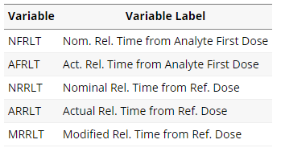

```{r setup, include=FALSE}
knitr::opts_chunk$set(echo = TRUE)
```

# Programming Workflow

Link to the [tutorial](https://cran.r-project.org/web/packages/admiral/vignettes/pk_adnca.html).

## Variable Names



## Read in Data
```{r}
# load libs
library(dplyr, warn.conflicts = FALSE)
library(admiral)
library(pharmaversesdtm)
library(lubridate)
library(stringr)
library(tibble)


# load dfs

data("admiral_adsl")
data("ex")
data("pc")
data("vs")
data("lb")


# prepare data

adsl <- admiral_adsl
ex <- convert_blanks_to_na(ex)

# Load PC
pc <- convert_blanks_to_na(pc)

# Load VS for baseline height and weight

vs <- convert_blanks_to_na(vs)

# Load LB for baseline lab values

lb <- convert_blanks_to_na(lb) %>%
  filter(LBBLFL == "Y")

# we can extract the label of a dataframe like this: 
attr(lb$LBBLFL, "label")

# ---- Lookup tables ----
param_lookup <- tibble::tribble(
  ~PCTESTCD, ~PARAMCD, ~PARAM, ~PARAMN,
  "XAN", "XAN", "Pharmacokinetic concentration of Xanomeline", 1,
  "DOSE", "DOSE", "Xanomeline Patch Dose", 2,
)
```

### Difference between tribbles and tibbles

* Tibble: A modern approach to data frames in R, provided by the tibble package. Tibbles are similar to data frames but with     some enhanced features and improved printing behavior.
* Tribble: A function within the tibble package that allows you to create tibbles row-wise instead of column-wise. It's          particularly useful for creating small tibbles by entering data directly into R code.


### What are expressions?

Functions: `expr()` and `exprs()`
In R, an expression is a set of symbols that can be evaluated to produce a value or perform some operation

In the context of statistical modeling in R, expressions are often used to specify formulas for regression models, where the response variable and predictor variables are combined using operators like +, -, *, and :.

Expressions can be manipulated, evaluated, and passed as arguments to functions in R, making them a powerful tool for programming and data analysis.

```{r}
print(expr(x + y))
```


```{r}
print(exprs(x + y, x + z, y + z))
```


### Functions used to derive the analysis dates: 

*derive_vars_merged():* new_vars: variables from the added data set that will be merged to the dataset, can also be renamed by for example expr(new_var1 = old_var1)
*derive_var_dtm():* Ddds to new date/time analysis columns DTM and TMF where you can choose a prefix
*derive_var_dtm_to_dt():* This function creates dates as output from datetime variables, adds column DT with prefix
*derive_var_dtm_to_tm():* This function creates time variable(s) as output from datetime variable(s), adds column TM with prefix
*derive_var_dtm_dy():* Adds relative day variables (--DY) to the dataset, e.g., ASTDY and AEND), adds column DY with prefix


### Joining of `ADSL` to `PC` domain


```{r}
adsl_vars <- exprs(TRTSDT, TRTSDTM, TRT01P, TRT01A)

pc_dates <- pc %>%
  # Join ADSL with PC (need TRTSDT for ADY derivation)
  derive_vars_merged(
    dataset_add = adsl,
    new_vars = adsl_vars,
    by_vars = exprs(STUDYID, USUBJID)
  ) %>%
  # Derive analysis date/time
  # Impute missing time to 00:00:00 
  derive_vars_dtm(
    new_vars_prefix = "A",
    dtc = PCDTC,
    time_imputation = "00:00:00"
  ) %>%
  # Derive dates and times from date/times
  derive_vars_dtm_to_dt(exprs(ADTM)) %>%
  derive_vars_dtm_to_tm(exprs(ADTM)) %>%
  derive_vars_dy(reference_date = TRTSDT, # refers to derive_vars_dt to impute and derive a date from a date character
                 source_vars = exprs(ADT) # source variable
                 ) %>%
  # Derive event ID and nominal relative time from first dose (NFRLT)
  mutate(
    EVID = 0,
    DRUG = PCTEST,
    NFRLT = if_else(PCTPTNUM < 0, 0, PCTPTNUM), .after = USUBJID
  )
```

### Joining of `ADSL` to `EX` domain

* Creation of  NFRLT for EX data based on VISITDY using the formula (VISITDY - 1) * 24 using dplyr::mutate.
* Use of case_when(): set of conditions, where last one is the fallback condition of no condition applying. I.e., if AENDTM is NA,  the value is ASTDTM and if not it's AENDTM

```{r}
# ---- Get dosing information ----

ex_dates <- ex %>%
  derive_vars_merged(
    dataset_add = adsl,
    new_vars = adsl_vars,
    by_vars = exprs(STUDYID, USUBJID)
  ) %>%
  # Keep records with nonzero dose
  filter(EXDOSE > 0) %>%
  # Add time and set missing end date to start date
  # Impute missing time to 00:00:00
  # Note all times are missing for dosing records in this example data
  # Derive Analysis Start and End Dates
  derive_vars_dtm(
    new_vars_prefix = "AST",
    dtc = EXSTDTC,
    time_imputation = "00:00:00"
  ) %>%
  derive_vars_dtm(
    new_vars_prefix = "AEN",
    dtc = EXENDTC,
    time_imputation = "00:00:00"
  ) %>%
  # Derive event ID and nominal relative time from first dose (NFRLT)
  mutate(
    EVID = 1,
    NFRLT = 24 * (VISITDY - 1), .after = USUBJID
  ) %>%
  # Set missing end dates to start date
  mutate(AENDTM = case_when(
    is.na(AENDTM) ~ ASTDTM,
    TRUE ~ AENDTM
  )) %>%
  # Derive dates from date/times
  derive_vars_dtm_to_dt(exprs(ASTDTM)) %>%
  derive_vars_dtm_to_dt(exprs(AENDTM))
```

### Discover the labels along with their abbrevitations

```{r}

df_list <- list("ADSL"=adsl, 
                "EX"=ex, 
                "LB"=lb, 
                "PC"=pc)

source("../R/search_colname.R")

```

```{r}
# search_colname(lb, ex, pc, adslaa)
```


## Expand dosing records

### Nominal vs. actual time

* The *nominal time* refers to the expected or planned time for an event or activity to occur. It is often an estimate or approximation based on a standard or average duration.
* The *actual time* refers to the real or measured time that an event or activity takes to complete. It reflects the precise duration that occurred in practice. 
* The difference between nominal and actual time can arise due to various factors such as unforeseen delays, variations in performance, or external influences.

### The functiom `create_single_dose_dataset()`

The function create_single_dose_dataset() can be used to expand dosing records between the start date and end date. The nominal time will also be expanded based on the values of EXDOSFRQ, for example “QD” will result in nominal time being incremented by 24 hours and “BID” will result in nominal time being incremented by 12 hours. This is a new feature of create_single_dose_dataset().

This function derives a dataset of single dose from aggregate dose information. This may be necessary when e.g. calculating last dose before an adverse event in ADAE or deriving a total dose parameter in ADEX when EXDOSFRQ != ONCE.

Usage

### The expansion

The function splits each aggregate dose row into multiple rows, each representing a single dose. It calculates the number of completed dose periods between the start and end dates or datetimes and multiplies it by the dose count. For certain dose windows (e.g., "WEEK", "MONTH", "YEAR"), it uses a conversion factor to convert time units into days. Observations with dose frequency "ONCE" are copied unchanged to the output dataset.

The output is the input dataset with each row representing a single dose.


In the input dataset, the doses are represented by several variables:

EXDOSFRQ: This variable denotes the dose frequency, indicating how often the medication is administered (e.g., "QD" for once daily, "Q2D" for every 2 days, "EVERY 2 WEEKS", etc.).
EXSTDTC: This variable represents the start date of each dose.
EXSTDTM: This variable represents the start date and time of each dose.
EXENDTC: This variable represents the end date of each dose.
EXENDTM: This variable represents the end date and time of each dose.
EXTRT: This variable represents the name of the treatment administered.
EXDOSE: This variable represents the dose amount administered.
EXDOSU: This variable represents the unit of the dose amount.

These variables provide information about the dosing regimen, including frequency, timing, duration, treatment name, and dose amount. 

The create_single_dose_dataset() function utilizes this information to create a dataset with each row representing a single dose.

```{r}
# ---- Expand dosing records between start and end dates ----

ex_exp <- ex_dates %>%
  create_single_dose_dataset(
    dose_freq = EXDOSFRQ,
    start_date = ASTDT,
    start_datetime = ASTDTM,
    end_date = AENDT,
    end_datetime = AENDTM,
    nominal_time = NFRLT,
    lookup_table = dose_freq_lookup,
    lookup_column = CDISC_VALUE,
    keep_source_vars = exprs(
      STUDYID, USUBJID, EVID, EXDOSFRQ, EXDOSFRM,
      NFRLT, EXDOSE, EXDOSU, EXTRT, ASTDT, ASTDTM, AENDT, AENDTM,
      VISIT, VISITNUM, VISITDY, TRT01A, TRT01P, DOMAIN, EXSEQ, !!!adsl_vars
    )
  ) %>%
  # Derive AVISIT based on nominal relative time
  # Derive AVISITN to nominal time in whole days using integer division
  # Define AVISIT based on nominal day
  mutate(
    AVISITN = NFRLT %/% 24 + 1,
    AVISIT = paste("Day", AVISITN),
    ADTM = ASTDTM,
    DRUG = EXTRT,
  ) %>%
  # Derive dates and times from datetimes
  derive_vars_dtm_to_dt(exprs(ADTM)) %>%
  derive_vars_dtm_to_tm(exprs(ADTM)) %>%
  derive_vars_dtm_to_tm(exprs(ASTDTM)) %>%
  derive_vars_dtm_to_tm(exprs(AENDTM)) %>%
  derive_vars_dy(reference_date = TRTSDT, source_vars = exprs(ADT))
```

To visualize what this function does we can compare th number of rows for subject id 01-701-1028

```{r}
dummy.id <- "01-701-1028"
ex_dates %>% filter(USUBJID == dummy.id)
```
```{r}
ex_exp %>% filter(USUBJID == dummy.id)
```


## Find First Dose

In this section we will find the first dose for each subject and drug, using derive_vars_merged(). We also create an analysis visit (AVISIT) based on NFRLT. The first dose datetime for an analyte FANLDTM is calculated as the minimum ADTM from the dosing records by subject and drug.

```{r}
# ---- Find first dose per treatment per subject ----
# ---- Join with ADPC data and keep only subjects with dosing ----

adpc_first_dose <- pc_dates %>%
  derive_vars_merged(
    dataset_add = ex_exp,
    filter_add = (EXDOSE > 0 & !is.na(ADTM)),
    new_vars = exprs(FANLDTM = ADTM),
    order = exprs(ADTM, EXSEQ),
    mode = "first",
    by_vars = exprs(STUDYID, USUBJID, DRUG)
  ) %>%
  filter(!is.na(FANLDTM)) %>%
  # Derive AVISIT based on nominal relative time
  # Derive AVISITN to nominal time in whole days using integer division
  # Define AVISIT based on nominal day
  mutate(
    AVISITN = NFRLT %/% 24 + 1,
    AVISIT = paste("Day", AVISITN)
  )
```


## Find Reference Dose Dates Corresponding to PK Records

### Use of `derive_vars_joined()`

Finds the previous dose data. This will join the expanded EX data with the ADPC based on the analysis date ADTM.

### Differnce between derive_vars_merged and derived_vars_joined

* derive_vars_merged:  Add new variable(s) to the input dataset based on variables from another dataset. The observations to merge can be selected by a condition (filter_add argument) and/or selecting the first or last observation for each by group (order and mode argument).

* derive_vars_joined: The function adds variables from an additional dataset to the input dataset. The selection of the observations from the additional dataset can depend on variables from both datasets. For example, add the lowest value (nadir) before the current observation.


### Find previous dose data

*-> ADTM > ADTM.join*

```{r}
# ---- Find previous dose  ----

adpc_prev <- adpc_first_dose %>%
  derive_vars_joined(
    dataset_add = ex_exp,
    by_vars = exprs(USUBJID),
    order = exprs(ADTM),
    new_vars = exprs(
      ADTM_prev = ADTM, EXDOSE_prev = EXDOSE, AVISIT_prev = AVISIT,
      AENDTM_prev = AENDTM
    ),
    join_vars = exprs(ADTM),
    join_type = "all",
    filter_add = NULL,
    filter_join = ADTM > ADTM.join,
    mode = "last",
    check_type = "none"
  )
```

### Find the next dose data

*-> ADTM <= ADTM.join*

```{r}
# ---- Find next dose  ----

adpc_next <- adpc_prev %>%
  derive_vars_joined(
    dataset_add = ex_exp,
    by_vars = exprs(USUBJID),
    order = exprs(ADTM),
    new_vars = exprs(
      ADTM_next = ADTM, EXDOSE_next = EXDOSE, AVISIT_next = AVISIT,
      AENDTM_next = AENDTM
    ),
    join_vars = exprs(ADTM),
    join_type = "all",
    filter_add = NULL,
    filter_join = ADTM <= ADTM.join,
    mode = "first",
    check_type = "none"
  )
```

### Find the previous and next nominal times

We sort by the nominal times (order argument) and the finding is achieved with the filter join argument differing between relative nominal times.

```{r}
# ---- Find previous nominal time ----

adpc_nom_prev <- adpc_next %>%
  derive_vars_joined(
    dataset_add = ex_exp,
    by_vars = exprs(USUBJID),
    order = exprs(NFRLT),
    new_vars = exprs(NFRLT_prev = NFRLT),
    join_vars = exprs(NFRLT),
    join_type = "all",
    filter_add = NULL,
    filter_join = NFRLT > NFRLT.join,
    mode = "last",
    check_type = "none"
  )

# ---- Find next nominal time ----

adpc_nom_next <- adpc_nom_prev %>%
  derive_vars_joined(
    dataset_add = ex_exp,
    by_vars = exprs(USUBJID),
    order = exprs(NFRLT),
    new_vars = exprs(NFRLT_next = NFRLT),
    join_vars = exprs(NFRLT),
    join_type = "all",
    filter_add = NULL,
    filter_join = NFRLT <= NFRLT.join,
    mode = "first",
    check_type = "none"
  )
```

## Combine PC and EX records and derive relative time variables

By combining PC and EX records we can derive additional relative time variables. Both dosing and concetration information is kept here, but sometimes we see ADPC data with only the concentration records. If this is desired we can drop the dosing column before saving the final dataset. 

### Use of the function `derive_vars_dutation`

Derives duration between two dates, specified by the variables present in input dataset e.g., duration of adverse events, relative day, age, ...

Calculates the actual relative time from from the first dose (AFRLT) and the actual relative time from the most recent dose (ARRLT). There is also a variable created that represents the actual time to next doese (AXRLT) to next dose.

We also calculate the reference dates FANLDTM (First Datetime of Dose for Analyte) and PCRFTDTM (Reference Datetime of Dose for Analyte) and their corresponding date and time variables.

### Combine ADPC and EX data

```{r}
# ---- Combine ADPC and EX data ----
# Derive Relative Time Variables

adpc_arrlt <- bind_rows(adpc_nom_next, ex_exp) %>%
  group_by(USUBJID, DRUG) %>%
  mutate(
    FANLDTM = min(FANLDTM, na.rm = TRUE),
    min_NFRLT = min(NFRLT_prev, na.rm = TRUE),
    maxdate = max(ADT[EVID == 0], na.rm = TRUE), .after = USUBJID
  ) %>%
  arrange(USUBJID, ADTM) %>%
  ungroup() %>%
  filter(ADT <= maxdate) %>%
  # Derive Actual Relative Time from First Dose (AFRLT)
  derive_vars_duration(
    new_var = AFRLT,
    start_date = FANLDTM,
    end_date = ADTM,
    out_unit = "hours",
    floor_in = FALSE,
    add_one = FALSE
  ) %>%
  # Derive Actual Relative Time from Reference Dose (ARRLT)
  derive_vars_duration(
    new_var = ARRLT,
    start_date = ADTM_prev,
    end_date = ADTM,
    out_unit = "hours",
    floor_in = FALSE,
    add_one = FALSE
  ) %>%
  # Derive Actual Relative Time from Next Dose (AXRLT not kept)
  derive_vars_duration(
    new_var = AXRLT,
    start_date = ADTM_next,
    end_date = ADTM,
    out_unit = "hours",
    floor_in = FALSE,
    add_one = FALSE
  ) %>%
  mutate(
    ARRLT = case_when(
      EVID == 1 ~ 0,
      is.na(ARRLT) ~ AXRLT,
      TRUE ~ ARRLT
    ),

    # Derive Reference Dose Date
    PCRFTDTM = case_when(
      EVID == 1 ~ ADTM,
      is.na(ADTM_prev) ~ ADTM_next,
      TRUE ~ ADTM_prev
    )
  ) %>%
  # Derive dates and times from datetimes
  derive_vars_dtm_to_dt(exprs(FANLDTM)) %>%
  derive_vars_dtm_to_tm(exprs(FANLDTM)) %>%
  derive_vars_dtm_to_dt(exprs(PCRFTDTM)) %>%
  derive_vars_dtm_to_tm(exprs(PCRFTDTM))

```


### Derive nominal relative times 

We calculate NRRLT generally as NFRLT - NFRLT_prev and NXRLT as NFRLT - NFRLT_next.

```{r}
adpc_nrrlt <- adpc_arrlt %>%
  # Derive Nominal Relative Time from Reference Dose (NRRLT)
  mutate(
    NRRLT = case_when(
      EVID == 1 ~ 0,
      is.na(NFRLT_prev) ~ NFRLT - min_NFRLT,
      TRUE ~ NFRLT - NFRLT_prev
    ),
    NXRLT = case_when(
      EVID == 1 ~ 0,
      TRUE ~ NFRLT - NFRLT_next
    )
  )
```

## Derive Analysis variables

* Using dplyr::mutate we derive a number of analysis variables including analysis value (AVAL), analysis time point (ATPT) analysis timepoint reference (ATPTREF) and baseline type (BASETYPE).
* We set ATPT to PCTPT for concentration records and to “Dose” for dosing records. The analysis timepoint reference ATPTREF will correspond to the dosing visit. We will use AVISIT_prev and AVISIT_next to derive.
*  The baseline type will be a concatenation of ATPTREF and “Baseline” with values such as “Day 1 Baseline”, “Day 2 Baseline”, etc. The baseline flag ABLFL will be set to “Y” for pre-dose records.
*  Analysis value AVAL in this example comes from PCSTRESN for concentration records. In addition we are including the dose value EXDOSE for dosing records and setting BLQ (Below Limit of Quantitation) records to 0 before the first dose and to 1/2 of LLOQ (Lower Limit of Quantitation) for records after first dose. We also create a listing-ready variable AVALCAT1 which includes the “BLQ” record indicator and formats the numeric values to three significant digits.
* We derive actual dose DOSEA based on EXDOSE_prev and EXDOSE_next and planned dose DOSEP based on the planned treatment TRT01P. In addition we add the units for the dose variables and the relative time variables.

```{r}
# ---- Derive Analysis Variables ----
# Derive ATPTN, ATPT, ATPTREF, ABLFL and BASETYPE
# Derive planned dose DOSEP, actual dose DOSEA and units
# Derive PARAMCD and relative time units
# Derive AVAL, AVALU and AVALCAT1

adpc_aval <- adpc_nrrlt %>%
  mutate(
    ATPTN = case_when(
      EVID == 1 ~ 0,
      TRUE ~ PCTPTNUM
    ),
    ATPT = case_when(
      EVID == 1 ~ "Dose",
      TRUE ~ PCTPT
    ),
    ATPTREF = case_when(
      EVID == 1 ~ AVISIT,
      is.na(AVISIT_prev) ~ AVISIT_next,
      TRUE ~ AVISIT_prev
    ),
    # Derive baseline flag for pre-dose records
    ABLFL = case_when(
      ATPT == "Pre-dose" ~ "Y",
      TRUE ~ NA_character_
    ),
    # Derive BASETYPE
    BASETYPE = paste(ATPTREF, "Baseline"),

    # Derive Actual Dose
    DOSEA = case_when(
      EVID == 1 ~ EXDOSE,
      is.na(EXDOSE_prev) ~ EXDOSE_next,
      TRUE ~ EXDOSE_prev
    ),
    # Derive Planned Dose
    DOSEP = case_when(
      TRT01P == "Xanomeline High Dose" ~ 81,
      TRT01P == "Xanomeline Low Dose" ~ 54
    ),
    DOSEU = "mg",
  ) %>%
  # Derive relative time units
  mutate(
    FRLTU = "h",
    RRLTU = "h",
    # Derive PARAMCD
    PARAMCD = coalesce(PCTESTCD, "DOSE"),
    ALLOQ = PCLLOQ,
    # Derive AVAL
    AVAL = case_when(
      EVID == 1 ~ EXDOSE,
      PCSTRESC == "<BLQ" & NFRLT == 0 ~ 0,
      PCSTRESC == "<BLQ" & NFRLT > 0 ~ 0.5 * ALLOQ,
      TRUE ~ PCSTRESN
    ),
    AVALU = case_when(
      EVID == 1 ~ EXDOSU,
      TRUE ~ PCSTRESU
    ),
    AVALCAT1 = if_else(PCSTRESC == "<BLQ", PCSTRESC, prettyNum(signif(AVAL, digits = 3))),
  ) %>%
  # Add SRCSEQ
  mutate(
    SRCDOM = DOMAIN,
    SRCVAR = "SEQ",
    SRCSEQ = coalesce(PCSEQ, EXSEQ)
  )
```


# Create dublicated records for analysis

* As mentioned above, the CDISC ADaM Implementation Guide for Non-compartmental Analysis uses duplicated records for analysis when a record needs to be used in more than one way. 24h post dose day x = predose day x+1
* In general, we will select the records of interest and then update the relative time variables for the duplicated records. In this case we will select where the nominal relative time to next dose is zero
* DTYPE is set to “COPY” for the duplicated records and the original PCSEQ value is retained. In this case we change “24h Post-dose” to “Pre-dose”. ABLFL is set to “Y” since these records will serve as baseline for the “Day 2” dose. DOSEA is set to EXDOSE_next and PCRFTDTM is set to ADTM_next.


```{r}
# ---- Create DTYPE copy records ----

dtype <- adpc_aval %>%
  filter(NFRLT > 0 & NXRLT == 0 & EVID == 0 & !is.na(AVISIT_next)) %>%
  select(-PCRFTDT, -PCRFTTM) %>%
  # Re-derive variables in for DTYPE copy records
  mutate(
    ABLFL = NA_character_,
    ATPTREF = AVISIT_next,
    ARRLT = AXRLT,
    NRRLT = NXRLT,
    PCRFTDTM = ADTM_next,
    DOSEA = EXDOSE_next,
    BASETYPE = paste(AVISIT_next, "Baseline"),
    ATPT = "Pre-dose",
    ATPTN = NFRLT,
    ABLFL = "Y",
    DTYPE = "COPY"
  ) %>%
  derive_vars_dtm_to_dt(exprs(PCRFTDTM)) %>%
  derive_vars_dtm_to_tm(exprs(PCRFTDTM))
```

## Combine ADPC data with duplicated records

Now the duplicated records are combined with the original records. We also derive the modified relative time from reference dose MRRLT. In this case, negative values of ARRLT are set to zero.

### Analysis Flags

This is also an opportunity to derive analysis flags e.g. ANL01FL , ANL02FL etc. In this example ANL01FL is set to “Y” for all records and ANL02FL is set to “Y” for all records except the duplicated records with DTYPE = “COPY”.

```{r}
# ---- Combine original records and DTYPE copy records ----

adpc_dtype <- bind_rows(adpc_aval, dtype) %>%
  arrange(STUDYID, USUBJID, BASETYPE, ADTM, NFRLT) %>%
  mutate(
    # Derive MRRLT, ANL01FL and ANL02FL
    MRRLT = if_else(ARRLT < 0, 0, ARRLT),
    ANL01FL = "Y",
    ANL02FL = if_else(is.na(DTYPE), "Y", NA_character_),
  )
```


## Calculate the change from abselin and assign ASEQ

In addition to numerous variable derivations, we  also derive PARAM and PARAMN from a lookup table.

### Functions: `derive_var_base`, `derive_var_chg`, `derive_var_obs_number`

* derive_var_base: Derive baseline variables, e.g. BASE or BNRIND, in a BDS dataset. Note: This is a wrapper function for the more generic derive_vars_merged().
* derive_var_chg: Derive change from baseline (CHG) in a BDS dataset
* derive_var_obs_number: derives ASEQ, so adds a variable numbering the observations within each by group

### Derivation

```{r}
# ---- Derive BASE and Calculate Change from Baseline ----

adpc_base <- adpc_dtype %>%
  # Derive BASE
  derive_var_base(
    by_vars = exprs(STUDYID, USUBJID, PARAMCD, BASETYPE),
    source_var = AVAL,
    new_var = BASE,
    filter = ABLFL == "Y"
  )

adpc_chg <- derive_var_chg(adpc_base)

# ---- Add ASEQ ----

adpc_aseq <- adpc_chg %>%
  # Calculate ASEQ
  derive_var_obs_number(
    new_var = ASEQ,
    by_vars = exprs(STUDYID, USUBJID),
    order = exprs(ADTM, BASETYPE, EVID, AVISITN, ATPTN, DTYPE),
    check_type = "error"
  ) %>%
  # Remove temporary variables
  select(
    -DOMAIN, -PCSEQ, -starts_with("orig"), -starts_with("min"),
    -starts_with("max"), -starts_with("EX"), -ends_with("next"),
    -ends_with("prev"), -DRUG, -EVID, -AXRLT, -NXRLT, -VISITDY
  ) %>%
  # Derive PARAM and PARAMN
  derive_vars_merged(
    dataset_add = select(param_lookup, -PCTESTCD), by_vars = exprs(PARAMCD)
  )
```

## Add additional baselines variables

Here we derive additional baseline values from VS for baseline height HTBL and weight WTBL and compute the body mass index (BMI) with compute_bmi(). Availabel form ADVSor derived from LB or ADLB.

```{r}
# Derive additional baselines from VS
adpc_baselines <- adpc_aseq %>%
  derive_vars_merged(
    dataset_add = vs,
    filter_add = VSTESTCD == "HEIGHT",
    by_vars = exprs(STUDYID, USUBJID),
    new_vars = exprs(HTBL = VSSTRESN, HTBLU = VSSTRESU)
  ) %>%
  derive_vars_merged(
    dataset_add = vs,
    filter_add = VSTESTCD == "WEIGHT" & VSBLFL == "Y",
    by_vars = exprs(STUDYID, USUBJID),
    new_vars = exprs(WTBL = VSSTRESN, WTBLU = VSSTRESU)
  ) %>%
  mutate(
    BMIBL = compute_bmi(height = HTBL, weight = WTBL),
    BMIBLU = "kg/m^2"
  )
```

## Add the ADSL variables

### Use of the bang (!) terminology

* !: The single bang operator negates a logical value or converts a value to a logical value and then negates it. For example, !TRUE evaluates to FALSE, and !FALSE evaluates to TRUE.

* !!: The double bang operator, or unquote operator, is used for unquoting an expression within a quoted context. It allows you to take a variable that contains an expression and evaluate it in the current context.

E.g. 

```{r}
# Example input
x <- 10
y <- "x"

# Example usage of !! to unquote
!!y
```


* !!!: The triple bang operator is used to splice (or unquote-splice) a list of arguments into a function call. It is used when you have a list of arguments that you want to pass to a function that accepts variable arguments.

```{r}
# Define a list of variables
vars_list <- list("var1", "var2", "var3")

# Using !!! to pass the list elements as separate arguments
result <- my_function(!!!vars_list)
```

### negate_vars

Function that adds a minus sign in front of all given variables

```{r}
# Add all ADSL variables
adpc <- adpc_baselines %>%
  derive_vars_merged(
    dataset_add = select(adsl, !!!negate_vars(adsl_vars)),
    by_vars = exprs(STUDYID, USUBJID)
  )
```


